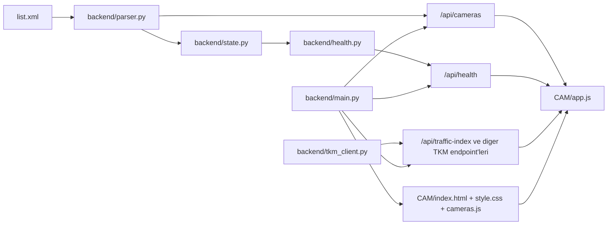

# IBBCAM

Istanbul Buyuksehir Belediyesi kamera verisini harita uzerinde gosteren ve kamera sagligini arka planda izleyen bir web uygulamasi.

Repo iki farkli katman icerir:

- `backend/`: `list.xml` verisini parse eden, hassas alanlari ayiklayan, saglik durumunu izleyen ve TKM endpoint'lerini proxy eden FastAPI uygulamasi
- `CAM/`: tarayicida calisan ana arayuz; FastAPI tarafindan kok dizinde servis edilir

Not: Repoda ayrica `frontend/` klasoru bulunuyor. Ancak mevcut uygulama giris noktasi `backend/main.py` icinde `CAM/` olarak tanimlanmis durumda; aktif olarak servis edilen arayuz budur.

## Ozellikler

- Istanbul geneline yayilmis kameralarin Leaflet haritasinda gosterimi
- Marker clustering ile yogun veri setinde kullanilabilir harita deneyimi
- Kamera listesinde arama, durum filtresi, ilce filtresi ve favoriler
- HLS yayini varsa video oynatma, yoksa goruntu karesi fallback'i
- Kamera bazli arka plan saglik kontrolu
- Trafik endeksi, kopru durumu, otopark, hava durumu ve benzeri TKM katmanlari
- `list.xml` icindeki hassas alanlarin API disina cikarilmasi

## Mimari



## Dizin yapisi

```text
.
|-- backend/          # FastAPI API, parser, health check ve TKM proxy katmani
|-- CAM/              # Uygulamanin aktif olarak servis edilen arayuzu
|-- frontend/         # Alternatif/moduler frontend calismalari
|-- tests/            # API, parser ve health testleri
|-- list.xml          # Ham kamera verisi
|-- README.md
`-- pyproject.toml    # pytest ayarlari
```

## Veri akisi

### 1. Ham veri

Kok dizindeki `list.xml`, `CameraIdentityCard` kayitlari icerir. Bu kayitlarda kamera adi, koordinatlar, aktiflik bilgisi, yakalama goruntusu ve yayin alanlari bulunur.

### 2. Parse ve filtreleme

`backend/parser.py` XML'i `xml.etree.ElementTree` ile parse eder ve yalnizca whitelist icindeki alanlari doner:

- `CameraNo`
- `CameraName`
- `XCoord`
- `YCoord`
- `IsActive`
- `State`
- `CameraCaptureImage`
- `CameraModel`
- `CameraBrand`
- `Resolution`
- `WowzaStreamSSL`
- `WowzaStream`

API'ye hic cikarilmayan alanlara ornek:

- `IPAddress`
- `RTSPURL`
- cesitli crop / format alanlari

Ayrica sifir ya da gecersiz koordinata sahip kayitlar backend tarafinda elenir.

### 3. Saglik durumu

`backend/health.py`, kameralar icin arka planda periyodik kontrol yapar ve sonucu `backend/state.py` icinde tutar. Frontend bu veriyi `/api/health` uzerinden tuketir.

### 4. TKM verileri

`backend/router_tkm.py`, IBB TKM servislerinden veri alip frontend icin normalize eden endpoint'ler sunar. Ornekler:

- `/api/traffic-index`
- `/api/announcements`
- `/api/bridges`
- `/api/parking`
- `/api/weather`
- `/api/travel-times`

## Arayuz

Aktif arayuz `CAM/` altindadir.

Temel dosyalar:

- `CAM/index.html`: sayfa kabugu, modal yapisi, CDN script/style yuklemeleri
- `CAM/app.js`: harita, filtreleme, modal, favoriler, saglik polling ve TKM katmanlari
- `CAM/style.css`: tum gorunum stili
- `CAM/cameras.js`: eski statik veri ciktilarindan biri
- `CAM/convert.py`: `list.xml -> cameras.js` donusum scripti

Onemli not:

- Guncel backend mimarisinde kamera verisi frontend'e `/api/cameras` uzerinden verilir.
- `CAM/cameras.js` ve `CAM/convert.py` hala repoda bulunur; bunlar statik veri akisi icin kullanilabilir, ancak uygulamanin aktif runtime akisi FastAPI API uzerindendir.

## Calistirma

### Gelistirme ortamı

Gereksinimler:

- Python 3.11+

Kurulum:

```bash
python -m venv .venv
.venv\Scripts\activate
pip install -r backend/requirements.txt
```

Uygulamayi baslatma:

```bash
uvicorn backend.main:app --reload
```

Ardindan tarayicida su adresi ac:

- `http://127.0.0.1:8000/`

API ornekleri:

- `http://127.0.0.1:8000/api/cameras`
- `http://127.0.0.1:8000/api/health`

### Sadece statik arayuzu acmak

Bu repo halen `CAM/index.html` dosyasini dogrudan acmaya uygun yapidadir. Ancak bu modda backend endpoint'leri kullanilmaz ve deneyim eksik kalabilir. Aktif kullanim icin FastAPI uzerinden servis etmek daha dogru yaklasimdir.

## Testler

Testleri calistirmak icin:

```bash
pytest
```

Kapsam:

- parser davranisi
- API endpoint'leri
- health state mantigi

## Statik veri donusumu

`list.xml` degistiginde eski statik akisi yeniden uretmek istersen:

```bash
cd CAM
python convert.py
```

Bu komut `CAM/cameras.js` dosyasini yeniden olusturur.

## Guvenlik notlari

- Kaynak XML icinde hassas olabilecek alanlar bulunabilir; backend bu alanlari istemciye gondermez.
- `list.xml` ozel veri gibi ele alinmalidir.
- Uygulama harici servislere baglidir; TKM veya kamera kaynaklari erisilemezse bazi katmanlar bos donebilir.
- `CAM/` altindaki eski statik akista veri dogrudan istemciye gomulebilir; bu nedenle paylasim yaparken hangi akisin kullanildigina dikkat edilmeli.

## Gelistirme notlari

- `backend/main.py`, kok URL'de `CAM/` klasorunu servis eder.
- `frontend/` klasoru gelecekteki modulerlestirme calismalari icin referans niteligindedir.
- `tests/test_api.py`, hassas alanlarin API yanitina sizmadigini dogrular.

## Ozet

Bu repo artik yalnizca statik bir harita sayfasi degil. Guncel yapi:

- `list.xml` verisini backend tarafinda parse eder
- hassas alanlari temizleyerek API sunar
- kamera sagligini arka planda izler
- TKM verilerini proxy eder
- `CAM/` arayuzunu FastAPI uzerinden servis eder
