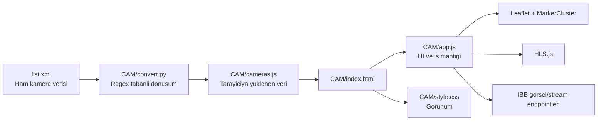

# IBB Kamera Görselleştirici

Bu repo, IBB kamera envanterini tek sayfalık bir web arayüzünde harita ve liste olarak gösteren statik bir istemcidir. Uygulama tamamen tarayıcı tarafında çalışır; sunucu kodu, build adımı ya da veritabanı yoktur.

Mevcut veri snapshot'ına göre sistem:

- `1593` kamera kaydı içerir.
- `1474` aktif, `119` pasif kayıt gösterir.
- `704` kayıtta HLS (`.m3u8`) akışı vardır.
- `838` kayıtta RTSP adresi bulunur.
- Tüm kayıtlar haritada kullanılabilecek koordinat bilgisi taşır.

## Proje Ne Yapar

- İstanbul genelindeki kameraları Leaflet haritasında kümelenmiş marker'lar olarak gösterir.
- Sol panelde kamera listesini arama ve durum filtresi ile daraltır.
- Kamera seçildiğinde haritayı ilgili noktaya götürür ve detay modalını açar.
- Uygun kamera için HLS canlı yayını oynatır.
- Akış yoksa veya oynatma başarısızsa son görüntü karesini gösterir.

## Mimari



## Dizin Yapısı

```text
.
├── list.xml          # Ham kamera verisi
├── README.md         # Bu dokuman
└── CAM/
    ├── index.html    # Uygulama kabugu
    ├── app.js        # Harita, filtre, liste ve modal davranislari
    ├── style.css     # Tum arayuz stilleri
    ├── cameras.js    # XML'den uretilen istemci verisi
    └── convert.py    # list.xml -> cameras.js donusum scripti
```

## Bileşenler Nasıl Çalışıyor

### 1. Veri kaynağı

- Kaynağın aslı kökte duran [`list.xml`](./list.xml) dosyasıdır.
- XML, `CameraIdentityCard` elemanlarından oluşur.
- Kayıtlarda kamera adı, numarası, marka/model, koordinatlar, aktiflik durumu, görüntü URL'si, RTSP adresi ve bazen HLS yayın adresi bulunur.

Öne çıkan alanlar:

- `CameraNo`: benzersiz kamera kimliği
- `CameraName`: arayüzde görünen isim
- `IsActive` ve `State`: aktif/pasif bilgisi
- `XCoord` ve `YCoord`: harita koordinatları
- `CameraCaptureImage`: ekran görüntüsü adresi
- `WowzaStreamSSL` / `WowzaStream`: HLS yayın adresi
- `RTSPURL`: ham yayın adresi

### 2. Dönüşüm katmanı

[`CAM/convert.py`](./CAM/convert.py), `list.xml` dosyasını okuyup `CAM/cameras.js` üretir.

Scriptin yaptığı işler:

1. XML içinden her `CameraIdentityCard` bloğunu regex ile ayıklar.
2. Her bloktaki alanları anahtar-değer çiftlerine çevirir.
3. `<Resolution/>` gibi self-closing alanları boş string olarak tamamlar.
4. Sonucu `const cameras = [...]` formatında JavaScript dosyası olarak yazar.

Önemli ayrıntı:

- Script, göreli yol olarak `../list.xml` kullandığı için `CAM` klasörü içinden çalıştırılmalıdır.

### 3. İstemci kabuğu

[`CAM/index.html`](./CAM/index.html):

- Sol tarafta sabit genişlikli bir sidebar oluşturur.
- Sağ tarafta tam ekran Leaflet haritası açar.
- Video/detail modalini tanımlar.
- Harici bağımlılıkları CDN üzerinden yükler:
  - Google Fonts
  - Leaflet
  - Leaflet.markercluster
  - HLS.js
- Üretilmiş veri dosyasını `cameras.js` ile global değişken olarak sayfaya dahil eder.

### 4. İstemci davranışı

[`CAM/app.js`](./CAM/app.js) uygulamanın bütün davranışını yönetir.

Başlangıç akışı:

1. Harita İstanbul merkezine yaklaşık `41.015, 28.979` koordinatlarında ve `zoom=11` ile açılır.
2. Karanlık CartoDB tile katmanı yüklenir.
3. `cameras` global dizisi alınır.
4. Geçerli koordinatı olmayan kayıtlar elenir.
5. Toplam, aktif ve pasif sayaçları hesaplanır.
6. Marker'lar ve liste ilk kez render edilir.

Etkileşim akışı:

- Arama kutusu yalnızca `CameraName` üzerinde istemci tarafında filtreleme yapar.
- Durum butonları `all`, `true`, `false` filtresi uygular.
- Harita marker'ları `MarkerClusterGroup` ile kümelenir.
- Popup içinde kamera adı, son görüntü, model ve durum bilgisi gösterilir.
- Popup içindeki `Görüntüle` butonu ya da listedeki kart, `openCameraModal` çağırır.
- Liste performans için en fazla ilk `100` sonucu render eder; kalan sonuç sayısı ayrıca gösterilir.

Modal akışı:

1. Kamera meta verileri doldurulur.
2. Önce `WowzaStreamSSL`, yoksa `WowzaStream` seçilir.
3. URL `.m3u8` ile bitiyorsa HLS.js ile oynatma denenir.
4. Tarayıcı doğal HLS destekliyorsa video elemanına doğrudan bağlanır.
5. Oynatma hatasında ya da yayın yoksa `CameraCaptureImage` gösterilir.
6. Modal kapanınca varsa HLS örneği temizlenir ve video kaynağı sıfırlanır.

## Görsel Katman

[`CAM/style.css`](./CAM/style.css) tek başına tüm görünümü yönetir.

Başlıca kararlar:

- Koyu tema kullanır.
- Cam efekti olan yarı saydam sidebar tasarımı vardır.
- Leaflet popup ve cluster renkleri projeye özel override edilir.
- Modal açılışında fade ve scale animasyonları uygulanır.
- Ayrı bir responsive breakpoint tanımı yoktur; stil dosyasında `@media` bloğu bulunmaz.

Bu nedenle mevcut tasarım masaüstü önceliklidir.

## Çalıştırma

### Hızlı kullanım

1. `list.xml` dosyasını güncelle.
2. `CAM` klasörüne gir.
3. `python3 convert.py` çalıştır.
4. `CAM/index.html` dosyasını tarayıcıda aç.

Komutlar:

```bash
cd CAM
python3 convert.py
```

İstersen repo kökünden statik sunucu da açabilirsin:

```bash
python3 -m http.server 8000
```

Sonra tarayıcıda `http://localhost:8000/CAM/` adresine git.

### Çalışma için gerekenler

- `python3` sadece veri dönüştürme için gerekir.
- Arayüzün düzgün çalışması için internet erişimi gerekir.

İnternet erişimi şu nedenlerle zorunludur:

- Leaflet, MarkerCluster ve HLS.js CDN'den gelir.
- Harita tile'ları uzaktan yüklenir.
- Kamera görselleri ve canlı yayın adresleri uzaktaki IBB servislerinden alınır.

## Veri ve Davranış Notları

- `list.xml` içindeki namespace bilgisi dönüşüm sırasında fiilen yok sayılır.
- `convert.py` gerçek bir XML parser değil, regex kullanır.
- Bu yaklaşım mevcut veri formatında çalışır; upstream XML yapısı değişirse script kırılabilir.
- `cameras.js` repoda tutulduğu için veri iki kez saklanmış olur: ham XML ve üretilmiş JS.
- `cameras.js` büyük bir dosyadır ve tamamı tek seferde tarayıcıya yüklenir.
- Arama, filtreleme ve render işlemleri tamamen istemci tarafında yapılır.

## Güvenlik ve Operasyonel Riskler

- Kaynak veri içinde iç ağ IP'leri, RTSP adresleri ve bazı kayıtlarda gömülü erişim bilgileri bulunuyor.
- Bu nedenle repo ve veri dosyaları özel kabul edilmelidir; herkese açık paylaşım uygun değildir.
- Uygulamada kimlik doğrulama, yetkilendirme veya erişim kontrolü yoktur.
- Harici servislerden biri erişilemezse harita katmanları, görseller veya yayınlar eksik çalışır.

## Bu Proje Ne Değil

- Backend uygulaması değil
- API servisi değil
- Gerçek zamanlı sunucu tarafı işleyen bir sistem değil
- Test, paketleme veya deploy otomasyonu olan bir proje değil

Özetle bu repo, mevcut kamera envanterini hızlıca görselleştirmek için hazırlanmış hafif bir tarayıcı uygulamasıdır. Asıl veri akışı `list.xml -> convert.py -> cameras.js -> index.html/app.js` zincirine dayanır.
"# IBBCAM" 
"# IBBCAM" 
